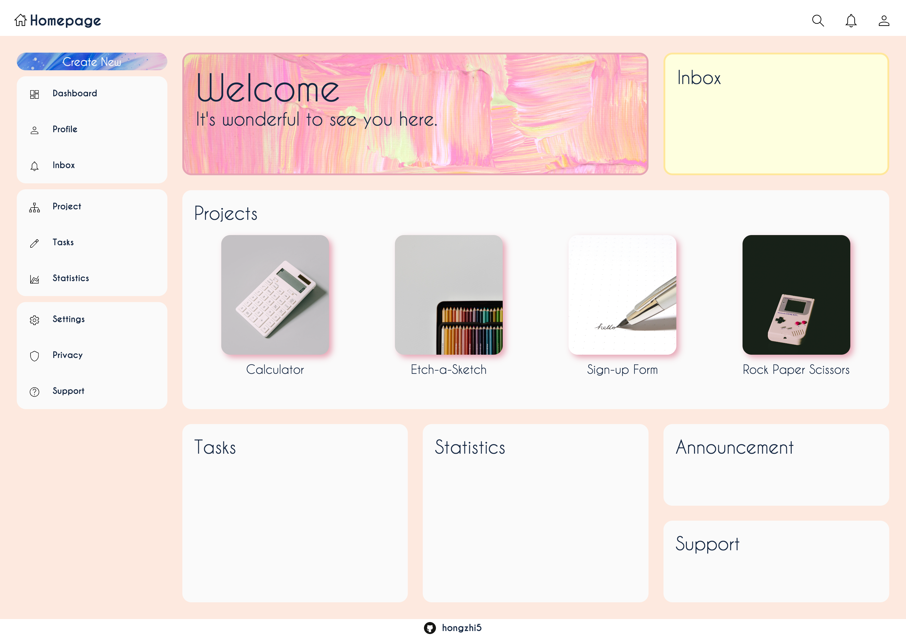

    <h1>📝</h1>
    <h3 align="center"><b>Admin Dashboard</b></h3>
    

    A simple admin dashboard project
     
     
    <a href="https://hongzhi5.github.io/admin-dashboard/">View Demo</a>
    ·
    <a href="https://github.com/hongzhi5/admin-dashboard">View Repo</a>
  

<!-- ABOUT THE PROJECT -->
## Description

This is a simple admin dashboard project built using HTML and CSS, designed primarily for practicing CSS Grid. It features a responsive layout with a header, sidebar, content sections, and a footer. 
 

## Preview

 

## Built With

-    
- 
 

## Features

- Responsive design
- Header with navigation links
- Sidebar with navigation links and icons
- Content sections
- Image buttons linking to external projects
 

## Credits

- Icons: [Pictogrammers](https://pictogrammers.com/)
- Images: [Unsplash](https://unsplash.com/)